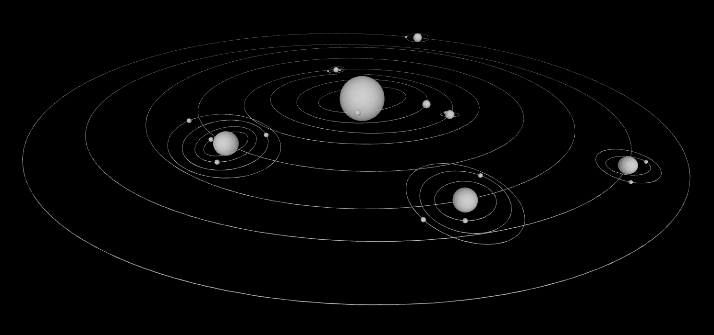

# Erratri

Erratri is a small geometry project that builds 3D shapes on the integer grid (Z^3) and exports binary STL. The demo renders a simple solar system with a sun, eight planets, their moons, and thin tilted orbit rings.

Note: This repository is a fully GPT-5 Codex experiment. All code and documentation were produced end-to-end by the agent in Codex CLI (no hands-on coding).

## Pure Z^3, Mesh-First

- All vertices live on the integer lattice Z^3 (no persistent floats).
- Shapes expose closed-surface meshes; many are built internally via tetra decompositions.
- Construction uses double math only transiently (e.g., rotations), then rounds back to the grid.
- Integer-only topology; rounding returns to Z^3 after transient double math.
- Higher-level shapes (sphere, cylinder shell, etc.) may decompose to tetrahedra internally.



## Demo Code

The demo uses a tiny data helper (`Demo/Planets.cs`) so `Program.cs` reads like a short scene description. Here is the essence of the program:

```csharp
using World;
using Geometry;
using Demo; // Planets helper (data only)

var world = new World();
var sunCenter = new Point(0, 0, 0);
world.Add(new Sphere(radius: 180, center: sunCenter));

void AddPlanet(in Planets.Planet p, double phaseDeg)
{
    // Thin tilted orbit ring
    world.Add(new Cylinder(radius: p.OrbitRadius, thickness: 2, height: 2,
                                   center: sunCenter, segments: null,
                                   xTiltDeg: p.InclinationDeg, yTiltDeg: 0, zSpinDeg: p.AscendingNodeDeg));

    // Place the planet on its tilted plane (details in Program.cs)
    // ... compute position and add spheres for planet and moons ...
}

// Mercury, Venus, Earth(+moon), Mars(+2), Jupiter(+4), Saturn(+3), Uranus(+2), Neptune(+1)
AddPlanet(Planets.Mercury, phaseDeg: 10);
AddPlanet(Planets.Venus, phaseDeg: 60);
AddPlanet(Planets.Earth, phaseDeg: 130);
AddPlanet(Planets.Mars, phaseDeg: 210);
AddPlanet(Planets.Jupiter, phaseDeg: 280);
AddPlanet(Planets.Saturn, phaseDeg: 330);
AddPlanet(Planets.Uranus, phaseDeg: 45);
AddPlanet(Planets.Neptune, phaseDeg: 95);

world.Save("clean_system.stl");
```

See the full, runnable code in:
- `Demo/Program.cs`
- `Demo/Planets.cs`

## Building and Running

- Build: `dotnet build Erratri.sln -c Release`
- Run demo: `dotnet run --project Demo -c Release`
- Output: `Demo/bin/Release/net9.0/clean_system.stl`

The screenshot above is `clean_system.png` generated from that STL.
